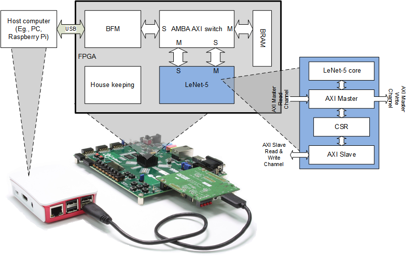
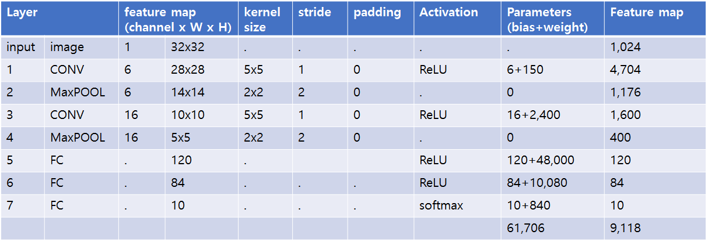
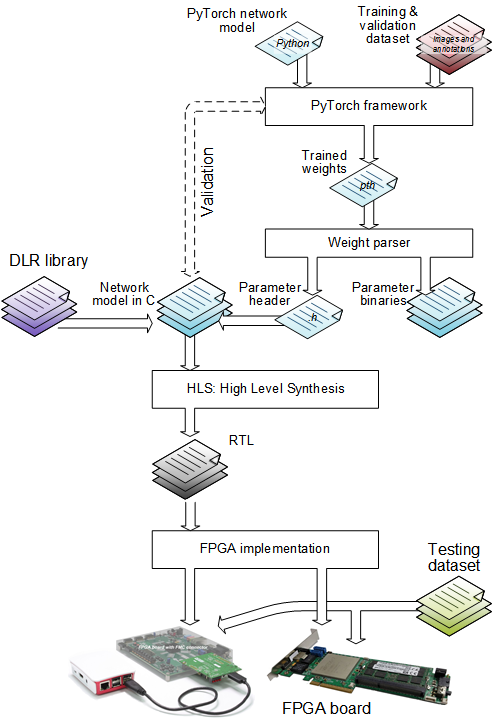
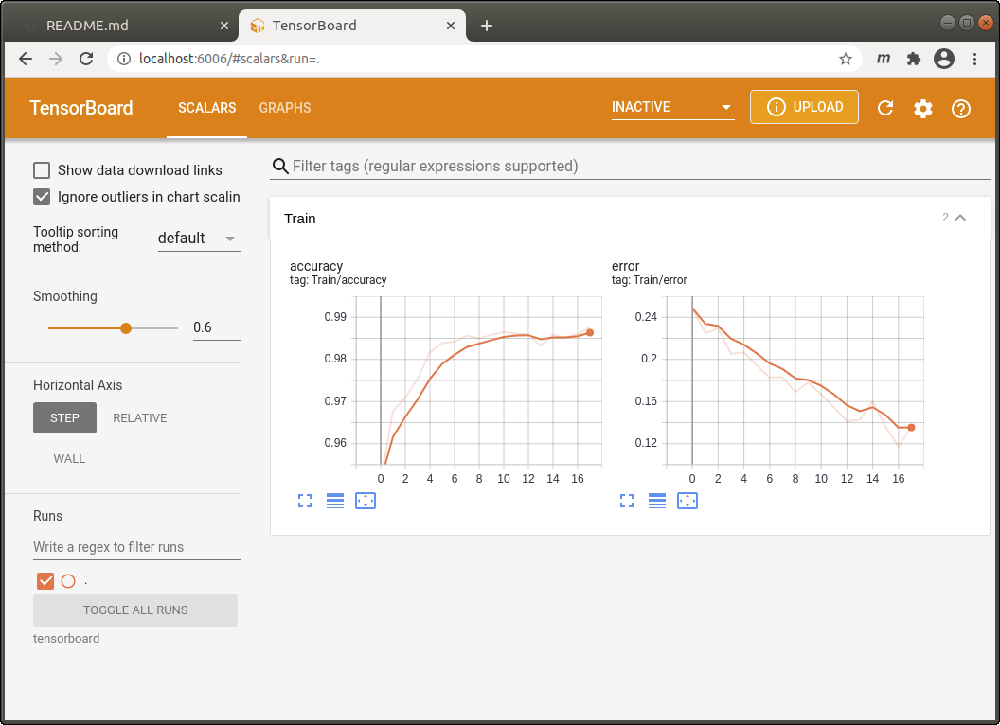
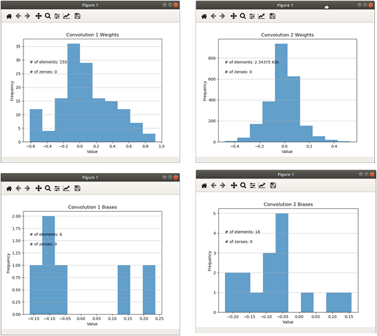
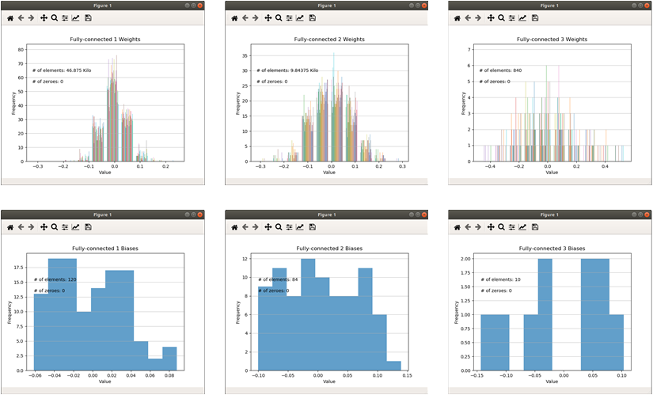
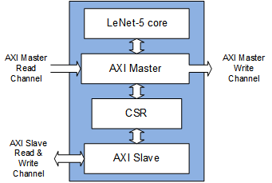
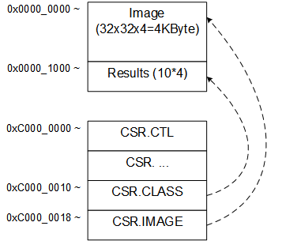
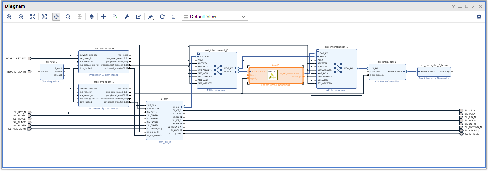

# LeNet-5 project using DLR (Deep Learning Routines)
This <a href="https://github.com/adki/DLR_Projects" target="_blank">project
(https://github.com/adki/DLR_Projects)</a> LeNet-5
explains how LeNet-5 is implemented on FPGA,
in which it uses following tools and libraries to implement the network on FPGA.

|  |
|:---:|
| *Running LeNet-5 on FPGA through USB* |

* PyTorch framework to train LeNet-5
* DLR (<a href="https://github.com/github-fds/Deep_Learning_Routines" target="_blank">Deep Learning Routines</a>) to model LeNet-5 in C++
* Xilinx HLS to get RTL of LeNet-5
* Xilinx Vivado to implement on FPGA
* Future Design Systems <a href="http://www.future-ds.com/en/products.html#CON_FMC" target="_blank">CON-FMC</a> to run LeNet-5 along with FPGA board through USB

## Table of contents

<details><summary>Click to expand table of contents</summary>

[Note](#note)<br>
[Prerequisites](#prerequisites)<br>

 [1. LeNet-5 network](#lenet-5_network)<br>
 [2. Design flow](#design_flow)<br>
 [3. Preparing and training the model using PyTorch](#pytorch_model_train)<br>
  3.1 Model<br>
  3.2 Training<br>
 [4. Weights conversion](#weights_conversion)<br>
  4.1 Getting C header file<br>
  4.2 Analysis weights and biases<br>
 [5. Proof the model using PyTorch and DLR](#proof)<br>
 [6. Preparing the model in C/C++](#dlr_model)<br>
 [7. Preparing RTL using HLS](#hls)<br>
  7.1 Hardware block<br>
  7.2 CSR address map<br>
  7.3 Simulation<br>
 [8. Implementation for FPGA](#imple)<br>
  8.1 Hardware block<br>
  8.2 Address map<br>
 [9. Running LeNet-5 on FPGA](#run)<br>
  9.1 Program FPGA<br>
  9.2 Run the program<br>

[Acknowledgment](#acknowledgment)<br>
[Authors and contributors](#authors_and_contributors)<br>
[License](#license)<br>
[Revision history](#revision_history)

</details>

---
### Note<a name="note"></a>
The main purpose of this project is to understand design flow and every details of network
by preparing the network using C/C++.
It should be noted that this project is not for performance optimization,
but for quick implementation.
It should be noted that DLR is not for training, but for inferencing.

### Prerequisites<a name="prerequisites"></a>
This program requires followings.
* Host computer: Ubuntu on Intel x86
* GNU GCC: C compiler
* Python and PyTorch
  * PyTorch CPU-only with Miniconda: https://pytorch.org/get-started/locally
* FPGA implementation: Xilinx Vivado 2019.2 (Xsim, HLS, ...)
  * Vivado WebPack: https://www.xilinx.com/support/download/index.html/content/xilinx/en/downloadNav/vivado-design-tools/archive.html
* FPGA board: Avenet ZedBoard
  * http://zedboard.org/product/zedboard
* USB interface board: Future Design Systems CON-FMC
  * https://github.com/github-fds/confmc.x86_64.linux.2020.06
* Some Python packages like 'mathplotlib', 'Tensorboard', and 'TensorboardX' are also required

---
### 1. LeNet-5 network<a name="lenet-5_network"></a>
LeNet-5 is a popular convolutional
neural network architecture for handwritten and
machine-printed character recognition.

Following picture shows network structure and its data size.
Input image is 32x32 single channel gray and [0.0:1.0] normalized.
Output result is 10 floating points corresponding probabilities of number 0 to 9.

|  |
|:---:|
| *LeNet-5 network* |

Following table shows a summary of the network and its parameters.
This network carries 61K parameters and it is about 241Kbyte for 4-byte floating points.

|  |
|:---:|
| *LeNet-5 network details* |

* number of biases = number of out_channels
* number of weights for convolution = (number of in_channels) x (number of out_channels) x (kernel_size x kernel_size)
* number of feature map = (number of out_channels) x (number of in_feature_map)
* number of weights for fully-connected = (number of in_feature) x (number of out_feature)

### 2. Design flow<a name="design_flow"></a>
The picture below shows an overall design flow from model training to FPGA implementation.

1. Preparing and training the model<br>
   LeNet-5 network is prepared and trained using PyTorch and MNIST dataset.
   This step produces trained weights in PyTorch format.
2. Preparing trained weights in C header and binary files<br>
   This step converts PyTorch format to C header file, which will be included in C/C++ model.
3. Proof of the model<br>
   This step verifies DLR along with PyTorch.
4. Preparing the model in C/C++<br>
   This step prepares the network in C/C++ using DLR.
5. High level synthesis to get RTL from C/C++ model.
7. Implementing the network model on FPGA<br>
   This step realizes the network for FPGA.

|  |
|:---:|
| *LeNet-5 design flow* |

### 3. Preparing and training the model using PyTorch<a name="pytorch_model_train"></a>
First of all, go to **$PROJECT/LeNet-5.pytorch** directory.<br>

This step requires PyTorch.

Simply run as follows to get trained weights.
```sh
$ cd $PROJECT/LeNet-5.pytorch
$ make run.train
```

Then, run to get inference result.
```sh
$ cd $PROJECT/LeNet-5.pytorch
$ make run.infer
```

<details><summary>Click to expand</summary>

#### 3.1 Model<a name="pytorch_model"></a>
The code below shows LeNet-5 network model explained in the table *LeNet-5 network details*.
The code is given as *lenet_model.py* in 'src' directory.<br>
The model can be checked by running the code as follows. Note that this step requires PyTorch.
```sh
$ python3 src/lenet5_model.py
```

<details><summary>Click to expand</summary>

```python
import torch
import torch.nn as nn
import torch.nn.functional as F

class Lenet5Model(nn.Module):
    def __init__(self, input_channels=1):
        super(Lenet5Model, self).__init__()
        self.input_channels = input_channels
        self.model = nn.Sequential(
                     nn.Conv2d( in_channels=input_channels
                              , out_channels=6
                              , kernel_size=(5,5)
                              , stride=1
                              , padding=0
                              , bias=True),# nn.Conv2d(1,6,5)
                     nn.ReLU(),
                     nn.MaxPool2d( kernel_size=(2,2)
                                 , stride=2),# nn.MaxPool2d(2)
                     nn.Conv2d( in_channels=6
                              , out_channels=16
                              , kernel_size=(5,5)
                              , stride=1
                              , padding=0
                              , bias=True),# nn.Conv2d(6,16,5)
                     nn.ReLU(),
                     nn.MaxPool2d( kernel_size=(2,2)
                                 , stride=2),# nn.MaxPool2d(2)
                     nn.Flatten( start_dim=1 # exclude batch
                               , end_dim=-1),# y = y.view(y.shape[0], -1)
                     nn.Linear( in_features=16*5*5
                              , out_features=120 # nn.Linear(400, 120)
                              , bias=True),
                     nn.ReLU(),
                     nn.Linear( in_features=120
                              , out_features=84 # nn.Linear(84, 84)
                              , bias=True),
                     nn.ReLU(),
                     nn.Linear( in_features=84
                              , out_features=10 # nn.Linear(84, 10)
                              , bias=True)
                     )

    def forward(self, x): # without softmax, fast converge and better result
        y = self.model(x) 
        return y

    def infer(self, x, softmax=True):
        y = self.forward(x)
        if softmax: y = F.softmax(y, dim=1)
        return y
```
</details>

#### 3.1 Training<a name="pytorch_train"></a>
You can see available options by running with '--help' option.
```sh
$ python3 src/lenet5_train.py --help
```
<details><summary>Click to see help message</summary>

```sh
usage: lenet5_train.py [-h] [-i input_channels] [-b batch_size] [-e epochs]
                       [-l learning_rate] [-a accuracy] [-c checkpoints]
                       [-t type] [-w file_name] [-g logdir] [-k] [-r] [-v]
                       [-d]

PyTorch LeNet-5

optional arguments:
  -h, --help            show this help message and exit
  -i input_channels, --input_channels input_channels
                        input channel size (default: 1)
  -b batch_size, --batch_size batch_size
                        input batch size (default: 100)
  -e epochs, --epochs epochs
                        number of epochs to train (default: 100)
  -l learning_rate, --learning_rate learning_rate
                        learning rate (default: 0.1)
  -a accuracy, --accuracy accuracy
                        learning rate (default: 0.1)
  -c checkpoints, --checkpoints checkpoints
                        directory name for checkpoint (default: checkpoints)
  -t type, --pre_trained_type type
                        type of pre-trained weights: "model", "params",
                        "weights", or "none" (default: "model")
  -w file_name, --pre_trained_weights file_name
                        pre-trained weight or model path_file_name for
                        checkpoint when '--type' is not none (default:
                        checkpoints/mnist_final.pth)
  -g logdir, --logdir logdir
                        directory name for log (default: tensorboard)
  -k, --keep            make keep intermediate weights (default: False)
  -r, --rigor           set rigor (default: False)
  -v, --verbose         make verbose (default: False)
  -d, --debug           make debug (default: False)
```
</details>

Run as follows.

```sh
$ python3 src/lenet5_train.py
```

This code prepares dataset from *http://yann.lecun.com/exdb/mnist* in the following directory.
* dataset.train/MNIST
* dataset.test/MNIST

Then, carries out training until accuracy reaches 0.99 or epoch reaches 100.
Intermediate results are stored in 'checkpoints' directory.
Followings are final result files.
* mnist_model_final.pth  - PyTorch parameter and model
* mnist_params_final.pth  - PyTorch parameter only
<!-- * mnist_final.weights  - Darknet format -->

When training does not reach at the accuracy 0.99 until 100 epochs,
simply run again.

While running training, you can check progress using Tensorboard.
```sh
$ tensorboard --logdir=tensorboard server
$ google-chrome http://localhost:6006
```

|  |
|:---:|
| *LeNet-5 training progress* |

Now you can run LeNet-5 model to predict for new input images as follows.
It should be noted that the result may differ since training results is differ.
```sh
$ python3 src/lenet5_infer.py samples/t_00_c4.png
0: -13.65079
1: -6.15322
2: -6.61728
3: -19.04249
4: 47.54378
5: -7.11956
6: -4.34857
7: -1.04366
8: 5.09734
9: 6.01078
```

</details>

### 4. Weights conversion<a name="weights_conversion"></a>
First of all, go to **$PROJECT/LeNet-5.pytorch** directory.

#### 4.1 Getting C header file
Simply run as follows to get C header file of trained parameters, **lenet5_params.h**.
```sh
$ cd $PROJECT/LeNet-5.pytorch
$ make run.params
```

<details><summary>Click to see 'lenet5_params.h'</summary>

```c
const float conv1_bias[6]= { //  torch.Size([6])
-0.12715423, 0.31861544, 0.28352895, 0.0013063019, 0.00051533437, -0.024330929
};
const float conv1_weight[150]= { //  torch.Size([6, 1, 5, 5])
-0.2506813, 0.02748762, 0.22563115, 0.3041184, 0.2677712, -0.4858233, 
...};
const float conv2_bias[16]= { //  torch.Size([16])
-0.20479624, -0.10206448, -0.088119015, 0.092432074, -0.0009077392, -0.13282152,
...};
const float conv2_weight[2400]= { //  torch.Size([16, 6, 5, 5])
...};
const float fc1_bias[120]= { //  torch.Size([120])
-0.0105780745, -0.00825386, 0.02470576, -0.036895536, 0.041986756, 0.0034808407,
...};
const float fc1_weight[48000]= { //  torch.Size([120, 400])
...};
const float fc2_bias[84]= { //  torch.Size([84])
0.016163042, -0.08301891, 0.0631961, 0.05435405, -0.08308794, 0.06956346,
...};
const float fc2_weight[10080]= { //  torch.Size([84, 120])
...};
const float fc3_bias[10]= { //  torch.Size([10])
-0.11194815, 0.088522755, -0.04713014, -0.11380346, 0.00060801016, -0.0901531,
...};
const float fc3_weight[840]= { //  torch.Size([10, 84])
...};
```

<!-- * lenet5.weights  - weights and bias in Darknet binary format -->

#### 4.2 Analysis weights and biases
Simply run as follows to get distribution of trained parameters.
```sh
$ cd $PROJECT/LeNet-5.pytorch
$ make run.histogram
```

Following picture shows distribution of parameters for convolutional layers,
in which there is no zero values.

|  |
|:---:|
| *LeNet-5 parameter distribution: convolution* |

Following picture shows distribution of parameters for fully-connected layers,
in which there is no zero values.

|  |
|:---:|
| *LeNet-5 parameter distribution: fully-connected* |

</details>

### 5. Proof the model using PyTorch and DLR<a name="proof"></a>
First of all, go to **$PROJECT/LeNet-5.pytorch.dlr** directory and
have a look at 'src/lenet5_infer.py' file.<br>

This step requires DLR (Deep Learning Routines) library and its PyTorch wrapper.
'DPU_HOME' macro in 'Makefile' should be set correctly, which is available from
<a href="http://github.com/github-fds/Deep_Learning_Routines" target="_blank">DLR:
Deep Learning Routines</a>.

Simply run as follows to see how it works.
```sh
$ cd $PROJECT/LeNet-5.pytorch.dlr
$ make run
```
This step runs LeNet-5 model using PyTorch Functional routines and
DLR routines. As the code below shows, 'pkg' can be 'F' or 'dlr' and
the former makes use of 'torch.nn.functional' and the latter DLR.

<details><summary>Click to see 'lenet5_infer.py'</summary>

```python
def lenet5_infer( input
                , c1_kernel, c1_bias
                , c2_kernel, c2_bias
                , f1_weight, f1_bias
                , f2_weight, f2_bias
                , f3_weight, f3_bias
                , softmax=True
                , pkg=F): # can be F (torch.nn.functional) or dlr (Deep Learning Routine)
    """ LeNet-5 inference network """
    z = pkg.conv2d( input=input, weight=c1_kernel, bias=c1_bias, stride=1
                  , padding=0, dilation=1, groups=1 )
    z = pkg.relu( input=z )
    z = pkg.max_pool2d( input=z, kernel_size=2, stride=2, padding=0, ceil_mode=False )

    z = pkg.conv2d( input=z, weight=c2_kernel, bias=c2_bias, stride=1
                , padding=0, dilation=1, groups=1 )
    z = pkg.relu( input=z )
    z = pkg.max_pool2d( input=z, kernel_size=2, stride=2, padding=0, ceil_mode=False )
    z = z.view(z.shape[0], -1) # do not use torch.flatten() to keep minibatch
    z = pkg.linear( input=z, weight=f1_weight, bias=f1_bias )
    z = pkg.relu( input=z )
    z = pkg.linear( input=z, weight=f2_weight, bias=f2_bias )
    z = pkg.relu( input=z )
    z = pkg.linear( input=z, weight=f3_weight, bias=f3_bias )
    if softmax: z = F.softmax( input=z, dim=1)
    return z
```

</details>

### 6. Preparing the model in C/C++<a name="dlr_model"></a>
First of all, go to **$PROJECT/LeNet-5.dlr/native.cpp** directory and
have a look at 'src/lenet5.cpp' file, in which 'lenet5_params.h'
comes from the result of [Weights conversion](#weights_conversion).<br>

This step requires DLR (Deep Learning Routines) library and its PyTorch wrapper.
'DPU_HOME' macro in 'Makefile' should be set correctly, which is available from
<a href="http://github.com/github-fds/Deep_Learning_Routines" target="_blank">DLR:
Deep Learning Routines</a>.

Simply run as follows to see how it works.
```sh
$ cd $PROJECT/LeNet-5.dlr/native.cpp
$ make run
```

<details><summary>Click to see 'lenet5.cpp'</summary>

```cpp
#if !defined(DTYPE)
#define DTYPE float
#endif

#include "dlr.hpp"
#include "lenet5_params.h"  // come from LeNet-5.pytorch

void lenet5(       DTYPE classes[10]
           , const DTYPE image  [32][32]
           #if !defined(__SYNTHESIS__)
           , const int rigor
           , const int verbose
           #endif
           )
{
          DTYPE     c1_out_data[6][28][28];
    const DTYPE   (*c1_in_data)[32][32]=(DTYPE (*)[32][32])image; // [1][32][32]
    const DTYPE   (*c1_kernel)[1][5][5]=(DTYPE (*)[1][5][5])conv1_weight; // [6][1][5][5]
    const DTYPE   (*c1_bias)=conv1_bias; // [6]
    const uint16_t  c1_out_size=28;
    const uint16_t  c1_in_size=32;
    const uint8_t   c1_kernel_size=5;
    const uint16_t  c1_bias_size=6;
    const uint16_t  c1_in_channel=1;
    const uint16_t  c1_out_channel=6;
    const uint8_t   c1_stride=1;
    const uint8_t   c1_padding=0;

    Convolution2d<DTYPE> (
            (DTYPE *)c1_out_data
          , (DTYPE *)c1_in_data
          , (DTYPE *)c1_kernel
          , (DTYPE *)c1_bias
          ,          c1_out_size
          ,          c1_in_size
          ,          c1_kernel_size
          ,          c1_bias_size
          ,          c1_in_channel
          ,          c1_out_channel
          ,          c1_stride
          ,          c1_padding
          #if !defined(__SYNTHESIS__)
          ,          rigor
          ,          verbose
          #endif
    );

          DTYPE     p1_out_data[6][14][14];
    const DTYPE   (*p1_in_data)[28][28]=c1_out_data; // [6][28][28]
    const uint16_t  p1_out_size=14;
    const uint16_t  p1_in_size=28;
    const uint8_t   p1_kernel_size=2;
    const uint8_t   p1_channel=6;
    const uint8_t   p1_stride=2;
    const uint8_t   p1_padding=0;
    const int       p1_ceil_mode=0;

    Pooling2dMax<DTYPE, 1> ( // ReLU embedded
            (DTYPE *)p1_out_data    // out_channel x out_size x out_size
          , (DTYPE *)p1_in_data     // in_channel x in_size x in_size
          ,          p1_out_size    // only for square matrix
          ,          p1_in_size     // only for square matrix
          ,          p1_kernel_size // only for square matrix
          ,          p1_channel
          ,          p1_stride
          ,          p1_padding
          ,          p1_ceil_mode
          #if !defined(__SYNTHESIS__)
          ,          rigor
          ,          verbose
          #endif
    );

          DTYPE     c2_out_data[16][10][10];
    const DTYPE   (*c2_in_data)[14][14]=p1_out_data; // [6][14][14]
    const DTYPE   (*c2_kernel)[6][5][5]=(DTYPE (*)[6][5][5])conv2_weight; // [16][6][5][5]
    const DTYPE   (*c2_bias)=conv2_bias; // [16]
    const uint16_t  c2_out_size=10;
    const uint16_t  c2_in_size=14;
    const uint8_t   c2_kernel_size=5;
    const uint16_t  c2_bias_size=16;
    const uint16_t  c2_in_channel=6;
    const uint16_t  c2_out_channel=16;
    const uint8_t   c2_stride=1;
    const uint8_t   c2_padding=0;

    Convolution2d<DTYPE> (
            (DTYPE *)c2_out_data
          , (DTYPE *)c2_in_data
          , (DTYPE *)c2_kernel
          , (DTYPE *)c2_bias
          ,          c2_out_size
          ,          c2_in_size
          ,          c2_kernel_size
          ,          c2_bias_size
          ,          c2_in_channel
          ,          c2_out_channel
          ,          c2_stride
          ,          c2_padding
          #if !defined(__SYNTHESIS__)
          ,          rigor
          ,          verbose
          #endif
    );

          DTYPE     p2_out_data[16][5][5];
    const DTYPE   (*p2_in_data)[10][10]=c2_out_data; // [16][10][10]
    const uint16_t  p2_out_size=5;
    const uint16_t  p2_in_size=10;
    const uint8_t   p2_kernel_size=2;
    const uint8_t   p2_channel=16;
    const uint8_t   p2_stride=2;
    const uint8_t   p2_padding=0;
    const int       p2_ceil_mode=0;

    Pooling2dMax<DTYPE, 1> ( // ReLU embedded
            (DTYPE *)p2_out_data
          , (DTYPE *)p2_in_data
          ,          p2_out_size
          ,          p2_in_size
          ,          p2_kernel_size
          ,          p2_channel
          ,          p2_stride
          ,          p2_padding
          ,          p2_ceil_mode
          #if !defined(__SYNTHESIS__)
          ,          rigor
          ,          verbose
          #endif
    );

          DTYPE     f1_out_data[120];
    const DTYPE   (*f1_in_data)[5][5]=p2_out_data; // [16][5][5]
    const DTYPE   (*f1_weight)[400]=(DTYPE (*)[400])fc1_weight; // [120][400]
    const DTYPE   (*f1_bias)=fc1_bias; // [120]
    const uint16_t  f1_out_size=120;
    const uint16_t  f1_in_size=16*5*5;
    const uint16_t  f1_bias_size=120;

    Linear1d<DTYPE, 1> ( // ReLU embedded
            (DTYPE *)f1_out_data
          , (DTYPE *)f1_in_data
          , (DTYPE *)f1_weight
          , (DTYPE *)f1_bias
          ,          f1_out_size
          ,          f1_in_size 
          ,          f1_bias_size
          #if !defined(__SYNTHESIS__)
          ,          rigor
          ,          verbose
          #endif
    );

          DTYPE     f2_out_data[84];
    const DTYPE   (*f2_in_data)=f1_out_data; // [120]
    const DTYPE   (*f2_weight)[120]=(DTYPE (*)[120])fc2_weight; // [84][120]
    const DTYPE   (*f2_bias)=fc2_bias; // [84]
    const uint16_t  f2_out_size=84;
    const uint16_t  f2_in_size=120;
    const uint16_t  f2_bias_size=84;

    Linear1d<DTYPE, 1> ( // ReLU embedded
            (DTYPE *)f2_out_data
          , (DTYPE *)f2_in_data
          , (DTYPE *)f2_weight
          , (DTYPE *)f2_bias
          ,          f2_out_size
          ,          f2_in_size 
          ,          f2_bias_size
          #if !defined(__SYNTHESIS__)
          ,          rigor
          ,          verbose
          #endif
    );

          DTYPE   (*f3_out_data)=classes; // [10]
    const DTYPE   (*f3_in_data)=f2_out_data; // [84]
    const DTYPE   (*f3_weight)[84]=(DTYPE (*)[84])fc3_weight; // [10][84]
    const DTYPE   (*f3_bias)=fc3_bias; // [10]
    const uint16_t  f3_out_size=10;
    const uint16_t  f3_in_size=84;
    const uint16_t  f3_bias_size=10;

    Linear1d<DTYPE, 0> ( // ReLU not embedded
            (DTYPE *)f3_out_data
          , (DTYPE *)f3_in_data
          , (DTYPE *)f3_weight
          , (DTYPE *)f3_bias
          ,          f3_out_size
          ,          f3_in_size 
          ,          f3_bias_size
          #if !defined(__SYNTHESIS__)
          ,          rigor
          ,          verbose
          #endif
    );
}
```

</details>

### 7. Preparing RTL using HLS<a name="hls"></a>
First of all, go to **$PROJECT/LeNet-5.dlr.fpga/hw/hls/tcl.float** directory and
have a look at 'script.tcl' file.<br>

This step requires DLR (Deep Learning Routines) library and its PyTorch wrapper.
'DPU_HOME' macro in 'Makefile' should be set correctly, which is available from
<a href="http://github.com/github-fds/Deep_Learning_Routines" target="_blank">DLR:
Deep Learning Routines</a>.
This step also requires Xilinx HLS.

Simply run as follows to see how it works.
```sh
$ cd $PROJECT/LeNet-5.dlr.fpga/hw/hls/tcl.float
$ make
```
This step runs Xilinx Vivado HLS to get RTL from LeNet-5 C model.

<details> <summary>Click to expand or collapse</summary>

#### 7.1 Hardware block
Following block is automatically generated by Xilinx HLS.

|  |
|:---:|
| *LeNet-5 block* |

<details> <summary>Click to see Verilog</summary>

```verilog
module ConvNormReluPoolWrapper (
       input      ap_clk
     , input      ap_rst_n
     , output     m_axi_memory_bus_AWVALID
     , input      m_axi_memory_bus_AWREADY
     , output     m_axi_memory_bus_AWADDR
     , output     m_axi_memory_bus_AWID
     , output     m_axi_memory_bus_AWLEN
     , output     m_axi_memory_bus_AWSIZE
     , output     m_axi_memory_bus_AWBURST
     , output     m_axi_memory_bus_AWLOCK
     , output     m_axi_memory_bus_AWCACHE
     , output     m_axi_memory_bus_AWPROT
     , output     m_axi_memory_bus_AWQOS
     , output     m_axi_memory_bus_AWREGION
     , output     m_axi_memory_bus_AWUSER
     , output     m_axi_memory_bus_WVALID
     , input      m_axi_memory_bus_WREADY
     , output     m_axi_memory_bus_WDATA
     , output     m_axi_memory_bus_WSTRB
     , output     m_axi_memory_bus_WLAST
     , output     m_axi_memory_bus_WID
     , output     m_axi_memory_bus_WUSER
     , output     m_axi_memory_bus_ARVALID
     , input      m_axi_memory_bus_ARREADY
     , output     m_axi_memory_bus_ARADDR
     , output     m_axi_memory_bus_ARID
     , output     m_axi_memory_bus_ARLEN
     , output     m_axi_memory_bus_ARSIZE
     , output     m_axi_memory_bus_ARBURST
     , output     m_axi_memory_bus_ARLOCK
     , output     m_axi_memory_bus_ARCACHE
     , output     m_axi_memory_bus_ARPROT
     , output     m_axi_memory_bus_ARQOS
     , output     m_axi_memory_bus_ARREGION
     , output     m_axi_memory_bus_ARUSER
     , input      m_axi_memory_bus_RVALID
     , output     m_axi_memory_bus_RREADY
     , input      m_axi_memory_bus_RDATA
     , input      m_axi_memory_bus_RLAST
     , input      m_axi_memory_bus_RID
     , input      m_axi_memory_bus_RUSER
     , input      m_axi_memory_bus_RRESP
     , input      m_axi_memory_bus_BVALID
     , output     m_axi_memory_bus_BREADY
     , input      m_axi_memory_bus_BRESP
     , input      m_axi_memory_bus_BID
     , input      m_axi_memory_bus_BUSER
     , output     s_axi_axilite_AWVALID
     , input      s_axi_axilite_AWREADY
     , output     s_axi_axilite_AWADDR
     , output     s_axi_axilite_WVALID
     , output     s_axi_axilite_WREADY
     , output     s_axi_axilite_WDATA
     , output     s_axi_axilite_WSTRB
     , output     s_axi_axilite_ARVALID
     , input      s_axi_axilite_ARREADY
     , output     s_axi_axilite_ARADDR
     , input      s_axi_axilite_RVALID
     , output     s_axi_axilite_RREADY
     , input      s_axi_axilite_RDATA
     , input      s_axi_axilite_RRESP
     , input      s_axi_axilite_BVALID
     , output     s_axi_axilite_BREADY
     , input      s_axi_axilite_BRESP
     , output     interrupt
);

endmodule
```

</details>

#### 7.2 CSR address map<a name="csr"></a>
More details can be found from following documents.

* Vivado Design Suite User Guide High-Level Synthesis, UG092, Xilinx.

```c
// ==============================================================
// Vivado(TM) HLS - High-Level Synthesis from C, C++ and SystemC v2019.2 (64-bit)
// Copyright 1986-2019 Xilinx, Inc. All Rights Reserved.
// ==============================================================
// ctl
// 0x00 : Control signals
//        bit 0  - ap_start (Read/Write/COH)
//        bit 1  - ap_done (Read/COR)
//        bit 2  - ap_idle (Read)
//        bit 3  - ap_ready (Read)
//        bit 7  - auto_restart (Read/Write)
//        others - reserved
// 0x04 : Global Interrupt Enable Register
//        bit 0  - Global Interrupt Enable (Read/Write)
//        others - reserved
// 0x08 : IP Interrupt Enable Register (Read/Write)
//        bit 0  - Channel 0 (ap_done)
//        bit 1  - Channel 1 (ap_ready)
//        others - reserved
// 0x0c : IP Interrupt Status Register (Read/TOW)
//        bit 0  - Channel 0 (ap_done)
//        bit 1  - Channel 1 (ap_ready)
//        others - reserved
// 0x10 : Data signal of classes
//        bit 31~0 - classes[31:0] (Read/Write)
// 0x14 : reserved
// 0x18 : Data signal of image_r
//        bit 31~0 - image_r[31:0] (Read/Write)
// 0x1c : reserved
// (SC = Self Clear, COR = Clear on Read, TOW = Toggle on Write, COH = Clear on Handshake)

#define XLENET5_CTL_ADDR_AP_CTRL      0x00
#define XLENET5_CTL_ADDR_GIE          0x04
#define XLENET5_CTL_ADDR_IER          0x08
#define XLENET5_CTL_ADDR_ISR          0x0c
#define XLENET5_CTL_ADDR_CLASSES_DATA 0x10
#define XLENET5_CTL_BITS_CLASSES_DATA 32
#define XLENET5_CTL_ADDR_IMAGE_R_DATA 0x18
#define XLENET5_CTL_BITS_IMAGE_R_DATA 32
```

Following two registers should be set properly before running.

* XLENET5_CTL_ADDR_CLASSES_DATA (csr_offset+0x10)<br>
  It should contain the address where inference results will be written.
* XLENET5_CTL_ADDR_IMAGE_R_DATA (csr_offset+0x18)<br>
  It should contain the address whrere input image resides.

|  |
|:---:|
| *LeNet-5 address setting* |

#### 7.3 Simulation
CSIM and COSIM can be run when you set 'CSIM' and 'COSIM' macro in the 'Makefile'.

To run CSIM.
```sh
$ cd $PROJECT/LeNet-5.dlr.fpga/hw/hls
$ make CSIM=1 SYN=0 COSIM=0
```

To run COSIM.
```sh
$ cd $PROJECT/LeNet-5.dlr.fpga/hw/hls
$ make CSIM=0 SYN=1 COSIM=1
```

</details>

### 8. Implementation for FPGA<a name="imple"></a>
This step requires Xilinx Vivado.

1. Prepare required IP

```sh
$ cd $PROJECT/LeNet-5.dlr.fpga/hw/iplib/bfm_axi/gen_ip/zed
$ make
```

2. Implement whole design

```sh
$ cd $PROJECT/LeNet-5.dlr.fpga/hw/impl/vivado.zed.confmc.float
$ make
```
This step runs Xilinx Vivado to get FPGA bitstream.

|  |
|:---:|
| *LeNet-5 block diagram* |

<details><summary>Click to expand or collapse</summary>

#### 8.1 Hardware block

|  |
|:---:|
| *LeNet-5 block diagram* |

#### 8.2 Address map
As shown picture above, two distinct address areas are used.

* 0x0000_0000 ~ : BRAM memory to store input image and output results
* 0xC000_0000 ~ : LeNet-5 internal registers
  * LeNet-5 internal registers locate in this address space.
  * Refer to [CSR address map](#csr).
  * 0xC000_0010: should be written 0x0000_1000. (at least a size of image frame apart from 0x0000_0000)
  * 0xC000_0018: should be written 0x0000_0000.

</details>

### 9. Running LeNet-5 on FPGA<a name="run"></a>

#### 9.1 Program FPGA
First of all, go to **$PROJECT/LeNet-5.dlr.fpga/hw/impl/vivado.zed.confmc.float** directory and
have a look at 'run_zed_example.tcl' file.
This step uses Xilinx Vivado to program FPGA through JTAG-USB port.
More details can be found from <a href="https://reference.digilentinc.com/learn/programmable-logic/tutorials/zedboard-programming-guide/start" target="_blank">Zedboard Programming Guide in SDK</a>.

Make a long story short, 

1. Connect JTAG-USB to the host computer
2. Invoke 'Vivado'
3. Select 'Hardware Manager'
4. Download following bit stream file
   * zed_example/zed_example.runs/impl_1/zed_bd_wrapper.bit

#### 9.2 Run the program
First of all, go to **$PROJECT/LeNet-5.dlr.fpga/sw.native/lenet.confmc** directory and
have a look at 'Makefile' file.
This step requires CON-FMC software package and more information can be found from
<a href="https://github.com/github-fds/confmc.x86_64.linux.2020.06" target="_blank">here</a>.

```sh
$ make
$ make run
./lenet ./images/0.png
    The probabilities of the digit being 0~9 are:
        0:  0.000000 
        1:  0.000000 
        2:  0.000000 
        3:  0.000000 
        4:  0.000000 
        5:  1.000000 *
        6:  0.000000 
        7:  0.000000 
        8:  0.000000 
        9:  0.000000 
./lenet ./images/1.png
    The probabilities of the digit being 0~9 are:
        0:  0.000000 
        1:  1.000000 *
        2:  0.000000 
        3:  0.000000 
        4:  0.000000 
        5:  0.000000 
        6:  0.000000 
        7:  0.000000 
        8:  0.000000 
        9:  0.000000 
```

---
### Acknowledgment<a name="acknowledgment"></a>
Future Design Systems allows us to use CON-FMC and its related resources.

### Authors and contributors<a name="authors_and_contributors"></a>
* **[Ando Ki]** - *Initial work* - <a href="http://www.future-ds.com" target="_blank">Future Design Systems</a>
* *Chae Eon Lim* who helped to implement LeNet-5 on FPGA using Xilinx HLS.

### License<a name="license"></a>
The contents of this repository is licensed with
the 2-clause BSD license to make the program and library useful in open and
closed source products independent of their licensing scheme.
Each contributor holds copyright over their respective contribution.

<details><summary>The 2-Clause BSD License</summary>
Copyright 2020-2021 Ando Ki (andoki(at)gmail.com)

Redistribution and use in source and binary forms, with or without modification, are permitted provided that the following conditions are met:

1. Redistributions of source code must retain the above copyright notice, this list of conditions and the following disclaimer.

2. Redistributions in binary form must reproduce the above copyright notice, this list of conditions and the following disclaimer in the documentation and/or other materials provided with the distribution.

THIS SOFTWARE IS PROVIDED BY THE COPYRIGHT HOLDERS AND CONTRIBUTORS "AS IS" AND ANY EXPRESS OR IMPLIED WARRANTIES, INCLUDING, BUT NOT LIMITED TO, THE IMPLIED WARRANTIES OF MERCHANTABILITY AND FITNESS FOR A PARTICULAR PURPOSE ARE DISCLAIMED. IN NO EVENT SHALL THE COPYRIGHT HOLDER OR CONTRIBUTORS BE LIABLE FOR ANY DIRECT, INDIRECT, INCIDENTAL, SPECIAL, EXEMPLARY, OR CONSEQUENTIAL DAMAGES (INCLUDING, BUT NOT LIMITED TO, PROCUREMENT OF SUBSTITUTE GOODS OR SERVICES; LOSS OF USE, DATA, OR PROFITS; OR BUSINESS INTERRUPTION) HOWEVER CAUSED AND ON ANY THEORY OF LIABILITY, WHETHER IN CONTRACT, STRICT LIABILITY, OR TORT (INCLUDING NEGLIGENCE OR OTHERWISE) ARISING IN ANY WAY OUT OF THE USE OF THIS SOFTWARE, EVEN IF ADVISED OF THE POSSIBILITY OF SUCH DAMAGE.
</details>

### Revision history<a name="revision_history"></a>
* 2021.01.13: Minor correction by Ando Ki
* 2020.12.25: Released by Ando Ki (andoki(at)gmail.com)
